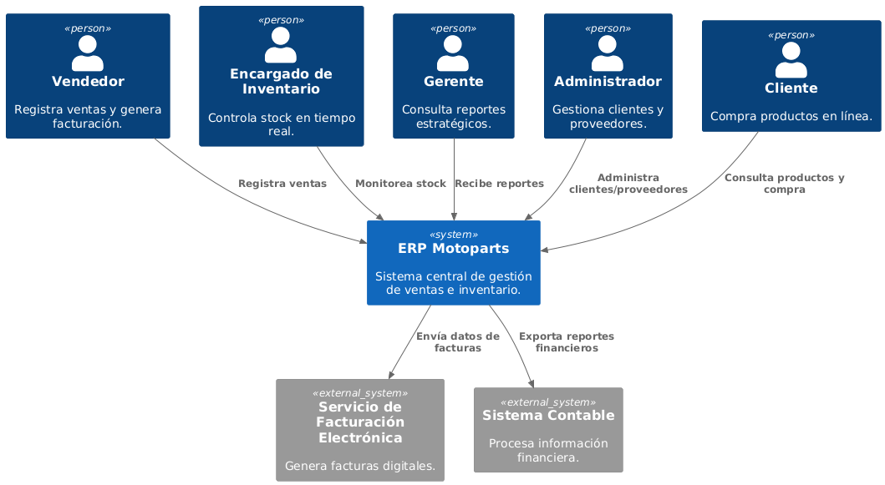

# 3. Alcance del Sistema y Contexto

El ERP Motoparts actúa como el sistema central de gestión para los procesos de negocio del concesionario.

## Diagrama de Contexto (C1)

## Actores Externos
- **Gestor de Compras:** Administra productos, proveedores y pedidos.
- **Encargado de Inventario:** Monitorea el stock y costos.
- **Gerente:** Revisa reportes estratégicos y de gestión.
- **Administrador:** Gestiona clientes, proveedores y empleados.
- **Cliente:** Consulta productos y realiza compras.
- **Sistema Contable:** Recibe información financiera exportada.
- **Servicio de Facturación Electrónica:** Genera las facturas digitales.
