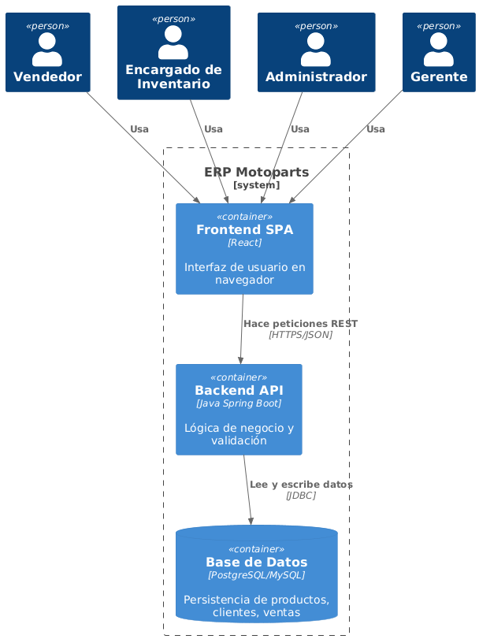

# 5. Vista de Bloques de Construcción

El sistema ERP Motoparts está compuesto por tres contenedores principales.

## Diagrama de Contenedores (C2)

### Contenedores
- **Frontend SPA (React):** Interfaz de usuario para gestores, administradores y clientes.
- **Backend API (Spring Boot):** Lógica de negocio centralizada (compras, facturación, stock, empleados, etc.).
- **Base de Datos (PostgreSQL):** Persistencia de datos de productos, proveedores, empleados, ventas y activos fijos.
