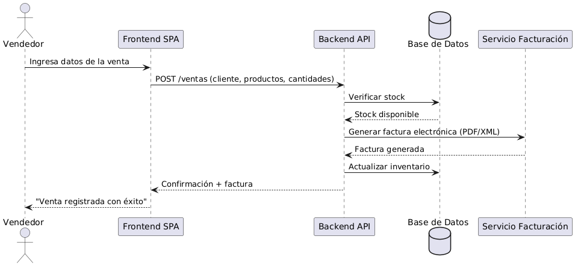

# 6. Vista de Ejecución (Runtime)

## Escenario: Registrar un Producto

Este escenario describe el flujo para la historia de usuario:

**Historia:**  
"Como gestor de inventario, quiero registrar nuevos productos con su información básica (nombre, descripción, unidad), para que pueda mantener un catálogo actualizado para las compras".

### Criterios de Aceptación
1. **Dado** que estoy en la pantalla de gestión de productos, **cuando** relleno el formulario con datos válidos y hago clic en "Guardar", **entonces** el nuevo producto debe aparecer en la lista.
2. **Dado** que intento guardar un producto, **cuando** dejo el campo "nombre" vacío, **entonces** el sistema debe mostrar un mensaje de error y no guardar el producto.
3. **Dado** que un producto ya existe, **cuando** intento registrarlo nuevamente, **entonces** el sistema debe evitar duplicados y mostrar advertencia.

## Diagrama de Secuencia

