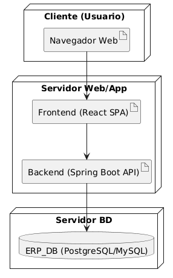

# 7. Vista de Despliegue

El despliegue básico se hace en una arquitectura cliente-servidor.

## Diagrama de Despliegue

### Infraestructura
- **Cliente (Navegador Web):** Accede a la SPA desarrollada en React.
- **Servidor Web/App:** Aloja tanto el frontend como la API de Spring Boot.
- **Servidor de Base de Datos:** PostgreSQL/MySQL con la información de negocio.
