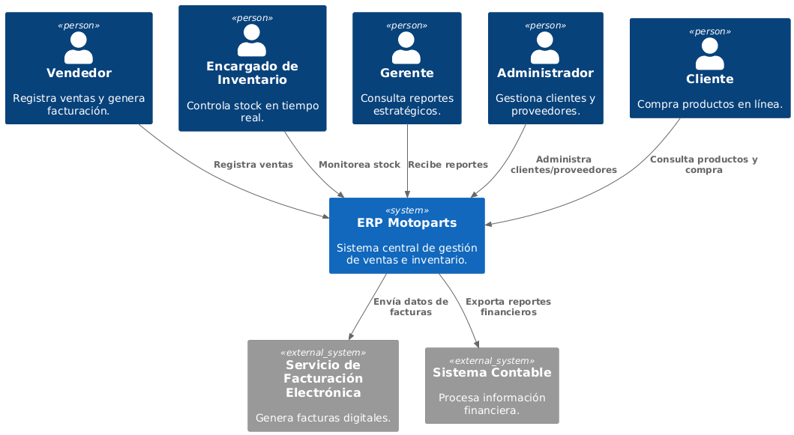
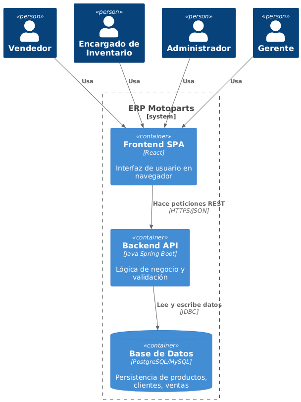
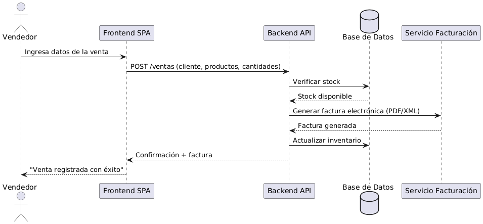
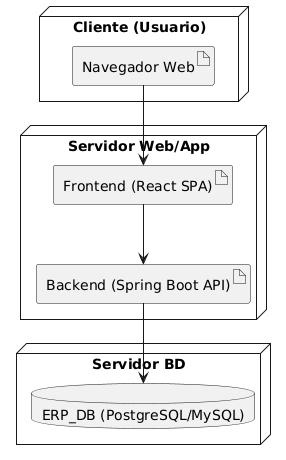

# Motoparts ERP

Repositorio de documentación y arquitectura del **ERP para repuestos y accesorios de motos**.  
Basado en la plantilla **arc42**.

---

## 📂 Estructura
- `docs/` → Documentación principal (arc42 en formato Markdown).
- `docs/images/` → Diagramas exportados en PNG.
- `docs/diagrams/` → Archivos `.puml` de PlantUML.

---

## 📖 Documentación arc42
- [01. Introduction and Goals](./docs/01_introduction_and_goals.md)
- [02. Architecture Constraints](./docs/02_architecture_constraints.md)
- [03. System Scope and Context](./docs/03_system_scope_and_context.md)
- [04. Solution Strategy](./docs/04_solution_strategy.md)
- [05. Building Block View](./docs/05_building_block_view.md)
- [06. Runtime View](./docs/06_runtime_view.md)
- [07. Deployment View](./docs/07_deployment_view.md)
- [08. Crosscutting Concepts](./docs/08_crosscutting_concepts.md)
- [09. Architecture Decisions](./docs/09_architecture_decisions.md)
- [10. Quality Scenarios](./docs/10_quality_scenarios.md)
- [11. Risks and Technical Debt](./docs/11_risks_and_technical_debt.md)
- [12. Glossary](./docs/12_glossary.md)

---

## 📊 Diagramas principales
- **Contexto (C1):** 
- **Contenedores (C2):** 
- **Secuencia HU1:** 
- **Despliegue:** 

---

## 🚀 Tecnologías
- Backend: Java + Spring Boot
- Frontend: React SPA
- Base de Datos: PostgreSQL/MySQL
- Documentación: arc42 + PlantUML
